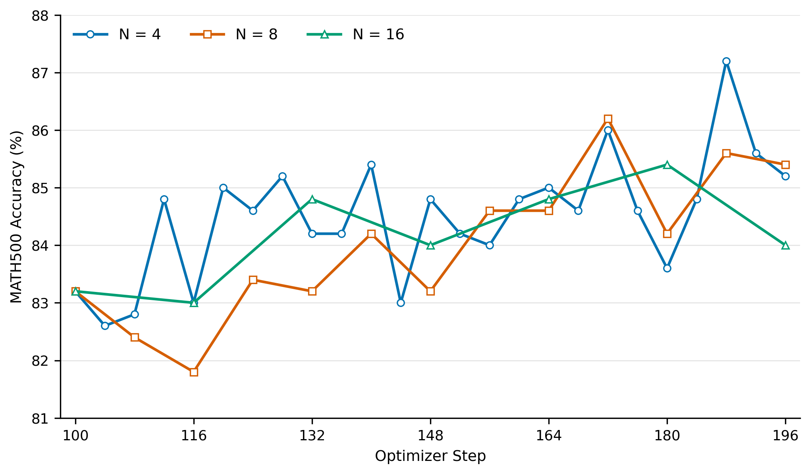

# 2026-09-02：首轮动态 Staleness Pilot 实验结果

结果核验日期：2026-09-02。实验设置、作业信息和原始产物入口见
[实验 README](../README.md)。本记录只保留已完成的 N=4/8/16 结果分析。

## 三分支完成后的对比（2026-09-02 核验）

**结论概览：N=16 没有出现持续训练崩溃，六个共同评测点上的 MATH500 均值与 N=4
接近；但漂移、裁剪压力和训练 reward 已出现可测差异，且 N=16 没有比 N=8 更快。**
因此，“能力差距暂时不大”符合这轮 pilot 的观测，“增大 N 几乎没有代价”则不符合。

### 1. 数据范围与平均口径

三个分支使用同一 update-100 checkpoint，均覆盖连续的 update 101--196。结果使用
[本地归档的原始 JSONL、逐题评测和 TensorBoard event](../raw/)；实验配置、job ID、
完成时间和远端路径见[实验 README](../README.md)。

| 项目 | N=4 | N=8 | N=16 |
| --- | ---: | ---: | ---: |
| 新增 optimizer update | 96 | 96 | 96 |
| JSONL 覆盖 | 101–196，连续 | 101–196，连续 | 101–196，连续 |
| rollout / 在线评测次数 | 24 | 12 | 6 |
| age 范围 | 0–3 | 0–7 | 0–15 |
| 非零 age 的 update 占比 | 75% | 87.5% | 93.75% |
| prompt group / response 总数 | 24,576 / 196,608 | 24,576 / 196,608 | 24,576 / 196,608 |

以下统一口径：

- 逐 update 表中的“均值”是 **96 条 update 指标的算术平均**；每条 token 指标内部已按
  有效 response token 聚合。不是把 96 步的全部 token 混在一起重算一个比例。
  复核 pooled-token clip fraction 得到 0.34215% / 0.40366% / 0.45792%，与等 update
  权重的结论一致。表中所有百分数均已乘 100；“百分点”与“相对增加百分比”分开表述。
- KL/ratio/clip 是该次 optimizer update **之前**的 forward 统计；编号 196 不等于
  更新完成后的终点模型测量。在线 MATH500 则在完整一轮更新之后评测。
- 三组无前缀与 `update_*` 的 KL、clip、PG clip、ESS 数值一致；age 0 的 update-only
  ratio mean 为 1，KL/clip/PG clip 为 0。288 条记录的 finite fraction 均为 1。
- reward、回答长度、熵来自各自 rollout 的 TensorBoard 标量，分别有 24/12/6 个点。
  分支内 rollout 大小固定，所以 reward 的等 rollout 平均也是等 response 平均。
  熵保留原 TensorBoard 聚合口径，不冒充把全部 token 汇总后的全局熵。
- MATH500 横向比较只用三个分支共同的 116、132、148、164、180、196 六个检查点。
  这些是同一套题的重复评测，不是六个独立 seed。
- N=16 的 `training/epoch=1`，N=4/8 为 0。代码以恢复的 outer step 25 除以当前
  dataloader 长度计算这个标签；N=16 的 loader 长度为 18，故得到 1。数据状态另由
  checkpoint 的 `data.pt` 恢复；不能把该标签当成额外训练一轮或跨分支对齐轴。

### 2. 能力表现：终点稍低，但共同轨迹没有持续落后

| Gradient step | N=4 MATH500 | N=8 MATH500 | N=16 MATH500 |
| --- | ---: | ---: | ---: |
| 116 | 83.0% | 81.8% | 83.0% |
| 132 | 84.2% | 83.2% | 84.8% |
| 148 | 84.8% | 83.2% | 84.0% |
| 164 | 85.0% | 84.6% | 84.8% |
| 180 | 83.6% | 84.2% | 85.4% |
| 196 | 85.2% | 85.4% | 84.0% |
| 六个共同检查点均值 | 84.300% | 83.733% | 84.333% |

共享起点 update 100 为 83.2%。终点分别答对 426、427、420 题；N=16 比 N=4 少 6 题、
比 N=8 少 7 题，即低 1.2 / 1.4 个百分点，但仍比共享起点高 0.8 个百分点。
N=16 相对 N=4 在六个共同点中为 2 高、3 低、1 平，相对 N=8 为 5 高、1 低。
不能只选最后一个点宣称 N=16 持续退化，也不能用共同点均值接近宣称统计等价。

终点逐题配对进一步显示：N=4 与 N=16 有 409 题共同答对，17 题仅 N=4 对，11 题仅
N=16 对，63 题共同答错；N=8 与 N=16 则是 403 / 24 / 17 / 56 题。
总分接近不意味着模型在相同题目上完全一致，更不能据此推出两模型 KL 接近零。

### 3. 漂移与裁剪：N 增大后压力递增，但绝对裁剪比例仍低

| 指标（update 101–196 均值） | N=4 | N=8 | N=16 |
| --- | ---: | ---: | ---: |
| `update_sampled_kl` | 1.2016e-5 | 2.1044e-5 | 3.4057e-5 |
| `rollout_sampled_kl` | 3.8451e-4 | 3.8446e-4 | 4.0913e-4 |
| update mean absolute log-ratio | 0.003845 | 0.004628 | 0.005345 |
| rollout mean absolute log-ratio | 0.005523 | 0.005629 | 0.006042 |
| `clipfrac_total` | 0.3417% | 0.4035% | 0.4580% |
| `pg_clipfrac` | 0.0758% | 0.0919% | 0.1047% |
| 仅 age>0：`clipfrac_total` | 0.4556% | 0.4611% | 0.4885% |
| 仅 age>0：`pg_clipfrac` | 0.1011% | 0.1050% | 0.1117% |
| response 累计 absolute log-ratio 均值（update 口径） | 7.6178 | 8.6839 | 10.0958 |

N=16 相对 N=4：update sampled KL 为 2.83 倍，absolute log-ratio 增加 39.0%，整体
clip / PG clip 分别增加 34.0% / 38.2%；相对 N=8 则增加 61.8%、15.5%、13.5% / 14.0%。
这里 KL 的绝对值仍小，且它是会受正负 log-ratio 抵消的 sampled proxy，不能只用倍数
判断风险。rollout sampled KL 在 N=4/8 几乎相同，但 N=16 高约 6.4%，不是三组都不变。

**把“更常用陈旧数据”和“陈旧数据的平均压力变化”分开。** 因 age 0 的两种 clip 均为 0：

```text
全部 update 的平均 clip = 非零 age 占比 × 非零 age 的平均 clip
```

N=4→16 的非零 age 占比从 75% 增至 93.75%；即便非零 age 的条件均值不变，整体均值
也会增加 25%。实际非零 age 的 clip / PG clip 条件均值又增加 7.2% / 10.5%，两者相乘
对应整体的 34.0% / 38.2%。这是均值的描述性分解，不是排除了模型轨迹、样本与 age
构成差异的因果分解；age>0 分别混合 age 1–3、1–7、1–15，也不是固定 age 对照。

`clipfrac_total` 统计 ratio 越出 [0.8,1.2] 的 token；`pg_clipfrac` 还要求与 advantage
方向共同满足 PPO 裁剪条件。两者均以全部有效 token 为分母，包含 A=0 的 token，
不能把 `1-pg_clipfrac` 命名为“有效 token 接受率”或“有学习信号的比例”。

### 4. 新增 age 8–15：同一 Gradient step 下的额外代价

在每个 16-update 区块的后半段选取相同绝对 step：109–116、125–132、141–148、
157–164、173–180、189–196，共 48 步。此时 N=16 使用 age 8–15，N=8 已刷新为
age 0–7，N=4 则经历两轮 age 0–3。

| 同步的 48 步均值 | N=4 | N=8 | N=16 |
| --- | ---: | ---: | ---: |
| update sampled KL | 1.5152e-5 | 1.7307e-5 | 4.8971e-5 |
| rollout sampled KL | 3.8215e-4 | 3.7962e-4 | 4.2428e-4 |
| update absolute log-ratio | 0.003809 | 0.004566 | 0.005858 |
| clip fraction | 0.3399% | 0.4007% | 0.5023% |
| PG clip fraction | 0.0754% | 0.0905% | 0.1158% |

相对 N=8，N=16 的 absolute log-ratio 在 48/48 步更高，clip 在 47/48 步更高，
PG clip 在 43/48 步更高，rollout sampled KL 在 42/48 步更高。对应均值分别增加
28.3%、25.3%、27.9%、11.8%；clip / PG clip 的绝对差为 0.1016 / 0.0253 个百分点。
这些逐步比较是描述性计数，同一 rollout 内有依赖，不能当成 48 个独立实验做显著性判断。

作为对照，在三个分支都处于 age 0–3 的共同 24 步上，clip 均值只有
0.3444% / 0.3348% / 0.3458%，PG clip 为 0.0765% / 0.0748% / 0.0775%。
在 N=8 与 N=16 同处 age 0–7 的共同 48 步上，clip 为 0.4063% / 0.4137%，
PG clip 为 0.0932% / 0.0937%。更明显的差异集中在 N=16 不刷新、继续使用额外 age 的时段。

但不能据此宣称 age 越大，每一步 KL 都必然更高。N=16 自身六轮的 age 7→15 对比中，
update sampled KL 均值由 4.5234e-5 变为 4.0020e-5，absolute log-ratio 由 0.005805
变为 0.005776，clip 则由 0.4917% 变为 0.5030%。不同 age 的 mini-batch 不同；这里
表现为平台附近的波动，而不是从 age 7 到 15 一直急剧恶化。

### 5. Ratio 尾部与梯度：典型压力上升，不等于异常随 N 单调增加

| 指标 | N=4 | N=8 | N=16 |
| --- | ---: | ---: | ---: |
| 非零 age 的 update ratio p99 均值 | 1.09225 | 1.09379 | 1.09747 |
| update ratio 二阶矩的逐步中位数 | 1.001328 | 1.001355 | 1.001432 |
| update ESS fraction 中位数 | 0.999316 | 0.999298 | 0.999246 |
| update ESS fraction 最小值 | 0.986331 | 2.6309e-7 | 0.998190 |
| update ESS<0.99 的步数 | 2 | 3 | 0 |
| rollout ESS fraction 最小值 | 0.999019 | 0.999146 | 0.999061 |
| gradient norm 均值 | 0.043354 | 0.042590 | 0.041954 |
| gradient norm 最大值 | 0.088688（u186） | 0.062259（u196） | 0.149138（u107） |

p99 是每步直方图分位数的平均，不是 pooled-token p99；原直方图的 log-ratio bin
宽度约 0.01，不能把表中 p99 的细小变化解释成高精度尾部差距。

- N=8 的 u159、age 2 存在极端 update/PPO ratio：ratio mean=126.63、二阶矩
  6.0953e10、最大 ratio 达统计实现的 `exp(20)` 上限，ESS=2.6309e-7。
  该步 rollout ESS 仍为 0.999284，gradient norm=0.04035。全程 ratio 二阶矩的
  算术平均会被这个点支配，因此上表同时保留典型值和极值，不隐去异常，也不由此宣称崩溃。
- N=16 未出现 ESS<0.99 的 update，不能据单次运行断言它比 N=8 更安全；极端尾部事件
  本身稀少，已有日志也不能定位到原 token 的概率和上下文。
- N=16 的最大梯度出现在 u107、age 6，并非新增 age 8–15 区间；该步 ESS=0.999208，
  下一步梯度恢复到 0.04051。没有持续梯度爆炸的轨迹证据，但不能只展示均值而忽略峰值。
  gradient norm 是全局梯度裁剪前的范数，包含训练损失各项，不等于 Adam 参数位移。

### 6. 训练 reward、回答长度和策略熵：并非三者完全一样

| 各自 rollout 的指标 | N=4 | N=8 | N=16 |
| --- | ---: | ---: | ---: |
| 平均训练 reward | 0.418818 | 0.406754 | 0.396886 |
| 末轮训练 reward | 0.445190 | 0.424927 | 0.409332 |
| 平均回答长度（token） | 1979.49 | 1876.53 | 1889.22 |
| 平均达到 3072 token 上限的比例 | 26.976% | 25.449% | 26.485% |
| `actor/entropy` 均值 | 0.083953 | 0.088794 | 0.098296 |
| 末轮 `actor/entropy` | 0.069472 | 0.079387 | 0.096392 |

N=16 的平均 reward 比 N=4 低 2.193 个百分点，比 N=8 低 0.987 个百分点。
按六个共同的 16-update 数据窗口汇总时，将 N=4 的四轮和 N=8 的两轮作等 response
权重平均，六个窗口均为 N=4 > N=8 > N=16。最后一个共同窗口分别为
0.443634 / 0.423889 / 0.409332。因此训练侧存在较一致的 reward 差异，即使 MATH500
共同点均值接近，也不能将两者混为“完全没有效果差别”。现有 reward 图仍保留各自原始
rollout 点，不将这项辅助窗口统计替换为新曲线。

这些 reward 是本轮旧策略生成数据的回报，不是更新后的模型对同一批新数据重评的回报。
熵来自 PPO 重算 old log probability 时、更新前的策略；N=16 的熵在这段训练中保持更高，
但“更高熵”本身不表示更好或更差。末轮 N=4/8/16 的行为策略分别来自 update 192/188/180，
所以末轮 reward/长度/熵不能当作三份 update-196 终点模型的同进度直接测量。

### 7. 实际效率：刷新次数减少，未带来成比例提速

| TensorBoard 实测统计 | N=4 | N=8 | N=16 |
| --- | ---: | ---: | ---: |
| rollout 刷新次数 | 24 | 12 | 6 |
| 训练循环总耗时 `Σ timing_s/step`（小时） | 28.364 | 26.898 | 27.157 |
| 生成耗时 `Σ timing_s/gen`（秒） | 35,144.1 | 33,495.2 | 33,946.9 |
| actor 更新耗时 `Σ timing_s/update_actor`（秒） | 47,032.3 | 44,788.7 | 45,118.3 |
| 评测耗时 `Σ timing_s/testing`（秒） | 1,327.1 | 667.1 | 341.1 |
| 有效 response token 总数（百万） | 389.184 | 368.942 | 371.435 |
| prompt+response token 总数（百万，TB） | 412.761 | 392.518 | 395.011 |
| `总 token / 总 step 秒数 / 4 卡`（token/s/GPU） | 1010.59 | 1013.37 | 1010.11 |

`timing_s/step` 是训练循环的实测时间；子项有嵌套，不能把整张表再次相加；它也不等于
含环境启动、恢复、退出等开销的 Slurm allocation 总时间。特别是 job 150042 同时含
anchor 和 N=8，不能直接拿整个 job 的 elapsed 与另两个 branch 比。

N=8 / N=16 比 N=4 的循环时间分别短 5.17% / 4.25%；N=16 反而比 N=8 长 0.96%。
N=8/16 生成的回答也更短、评测次数更少；按实际处理 token 归一后，吞吐约相同。
本 pilot 减少的是刷新次数，不是生成的 prompt/response 总数；不能宣传 2×/4× 加速，
也没有证据说明 N=16 已有优于 N=8 的吞吐—能力收益。

### 8. 对研究主线的结论与边界

1. **后期放大 N 的可行性信号存在。** 从同一 update 100 出发，三组完成相同 96 次更新，
   N=16 的六个共同 MATH500 点均值与 N=4 接近，未观察到持续数值发散。该结论限于
   此 checkpoint、数据、学习率、seed 和评测，不等于已经证明三组等价或 N=16 无损。
2. **代价首先体现为更频繁使用非零 age，并叠加额外 age 的压力。** N=16 的全部 update
   漂移/裁剪高于 N=8，age 8–15 时的同步对比差异更一致；但 age 7→15 不是简单线性恶化。
3. **能力、训练信号、稳定性与效率要分别判断。** N=16 的末点评分较低、训练 reward
   较低、熵较高、典型 ESS 略低，同时又没有复现 N=8 的极端 ESS 事件；这些现象不能
   压缩成“全好”或“全坏”一个排序。N=16 也未进一步提速。
4. **这三条后期分支仍不能证明“后期比早期更容忍”。** 需要 matched early/late 分支
   与额外 seed。已有 anchor 的 u1–24 包含 warmup，不宜不加控制地与后期作因果比较。
   在 N=16 分支自身，age 15 的前/后半段各仅 3 个点：absolute log-ratio 均值
   0.005906→0.005646、clip 0.5139%→0.4921%，但 PG clip 0.1122%→0.1164%；
   并非所有压力指标都随训练减小。
5. **现有测量还没有确定 KL 预算或最大安全 N。** sampled proxy、不同 rollout 前缀
   和单 seed 不能替代固定前缀上的全词表 KL 或阈值校准。三个分支均未留存终点权重，
   只有共享 update-100 完整 checkpoint；不能由这些日志补算三个 update-196 模型的
   两两 KL，也不能不重跑就继续到 update 292。

以上三组结论依据原始日志重新计算。正式结果只引用下面由现存脚本复现的三分支能力图；
早期没有现存绘图代码的探索图不作为本记录的正式图表。

## 确认图表



- 回答的问题：三个分支在共同真实 optimizer update 上的 MATH500 能力轨迹是否持续分离。
- 数据口径：只使用 update 116/132/148/164/180/196 六个共同检查点；同一套 500 题，
  不是六个独立 seed。
- 主要观察：N=16 的共同点均值接近 N=4，但 update-196 终点较低；该图不支持统计等价
  或“增大 N 无损”的结论。
- 生成脚本：[`plot_math500_branches.py`](../scripts/plot_math500_branches.py)。
- 矢量版本：[`PDF`](../figures/math500_branches_by_optimizer_step.pdf)。
