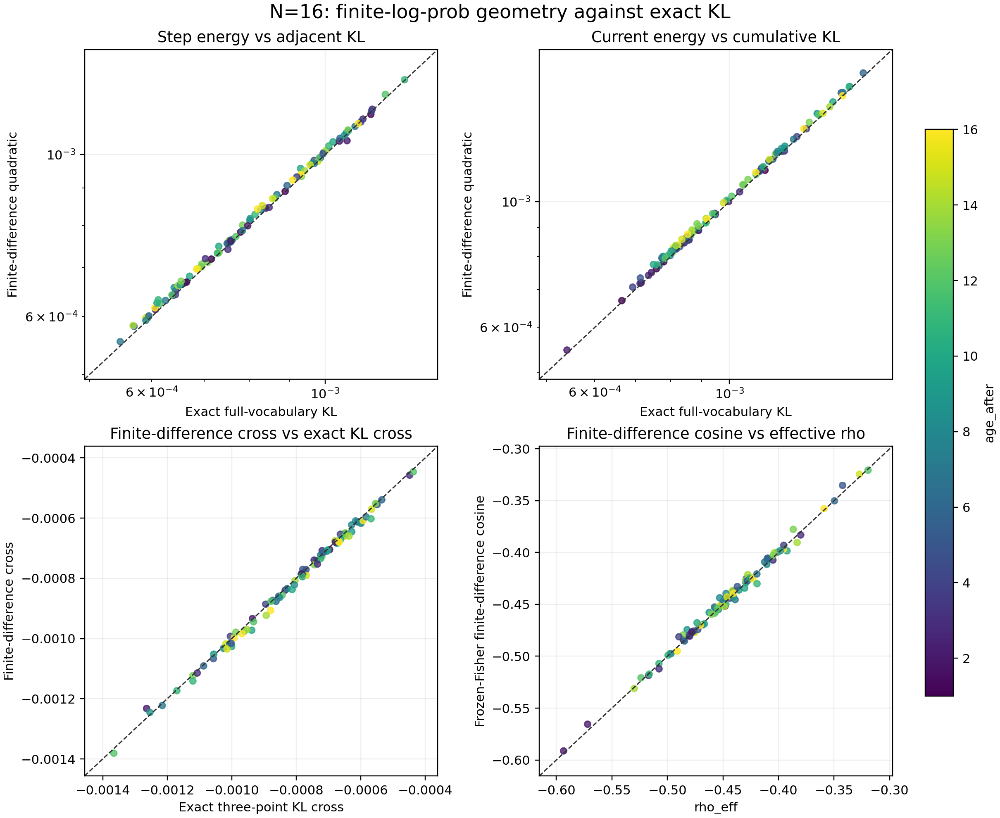
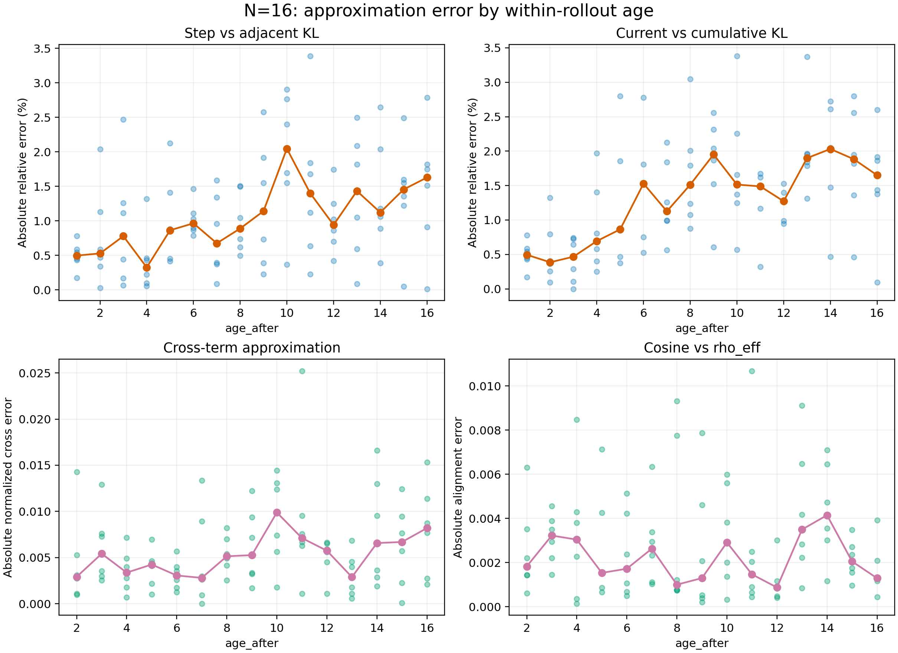

# N=16 logits 几何大 age 校验：实验记录

实验设置见[本实验 README](../README.md)；公式和指标定义见
[实验族 README](../../README.md)。本记录使用 job 167220 的 6 个 rollout、96 条逐 update
记录，每个 age 只有 6 个 anchor 观测。

## 四项近似结果

| 比较 | 有效点 | 中位误差 | P95 | 最大误差 | 关联与符号 |
| --- | ---: | ---: | ---: | ---: | --- |
| `fd_step` 对 `adjacent_kl` | 96 | 绝对相对误差 0.988% | 2.592% | 3.386% | 预测/精确中位比 1.00905 |
| `fd_current` 对 `cumulative_kl` | 96 | 绝对相对误差 1.343% | 2.782% | 3.380% | 预测/精确中位比 1.01343 |
| `fd_cross` 对精确 cross | 90 | 归一化绝对误差 0.457% | 1.387% | 2.523% | Pearson 0.99846；符号 90/90 一致 |
| `fd_cosine` 对 `rho_eff` | 90 | 绝对差 0.00215 | 0.00781 | 0.01068 | Pearson 0.99705；符号 90/90 一致 |

交叉项原始 MAE 为 `1.02e-5`。`rho_eff` 与有限差分 cosine 的中位数分别为
`-0.44730` 和 `-0.44416`，全部已定义点都为负。精确累计 KL 最大值为 `1.6613e-3`。

按预先划定的 age 区间，`fd_current` 的绝对相对误差中位数从 age 1–4 的 `0.496%`，
增至 age 5–8 的 `1.247%` 和 age 9–16 的 `1.638%`；`fd_step` 相应为 `0.455%`、
`0.891%`、`1.433%`。这表明 N=16 内出现温和的 age 相关误差增长，但最大误差仍低于
3.4%。

上图分别回答整体贴合程度和误差随 age 的变化；颜色表示 age，逐 age 实线为 6 个点的
中位数。矢量版本见 [`四项对照 PDF`](../figures/kl_approximation_2x2.pdf)和
[`逐 age 误差 PDF`](../figures/kl_approximation_error_by_age.pdf)。

## 解释与边界

到 age 16 为止，没有观察到有限差分几何突然失效：两个 KL 近似的整体典型误差约
1%–1.3%，交叉项和归一化方向仍高度一致且全部保持负号。负交叉项解释了为什么窗口
增大后累计 KL 仍只达到约 `1.66e-3`，而不是单步 KL 的简单累加。

误差随 age 温和上升值得后续验证，但这里只含 6 个 rollout 且仅一个 seed，不能把趋势
估计成总体规律，也不能与其他 N 作因果比较；这些量还使用了已经发生的未来 logits，
不是前瞻预测特征。

## 复现

[`../../scripts/analyze_kl_approximation.py`](../../scripts/analyze_kl_approximation.py)从
`raw/job167220/kl_updates.jsonl` 只读生成 [`汇总 JSON`](../tables/kl_approximation_summary.json)、
[`逐 update 明细`](../tables/kl_approximation_per_update.csv)和
[`逐 age 汇总`](../tables/kl_approximation_by_age.csv)。
