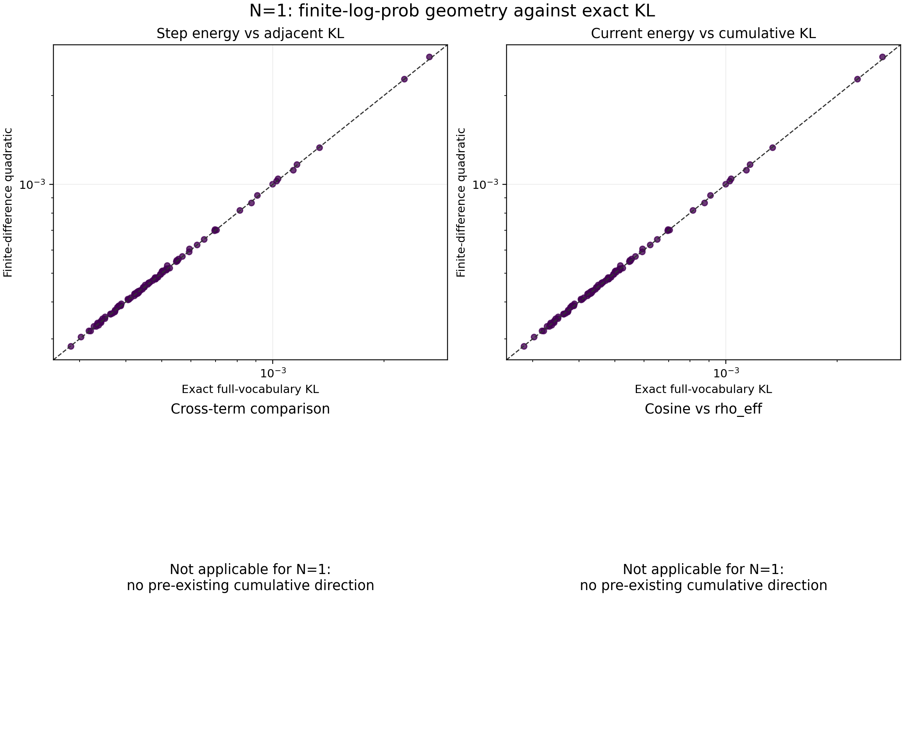

# N=1 logits 几何边界控制：实验记录

实验设置与作业信息见[本实验 README](../README.md)；四个比较的公式、统计指标和数学
意义见[实验族 README](../../README.md)。本记录只使用 job 167543 的 96 条正式逐 update
记录，不比较能力或策略效果。

## 结果

96 个 optimizer step 连续且分别属于 96 个 context set；每条均为 `age_after=1`、
`policy_age=0`。每轮有 510–512 个有效位置，聚合权重和为 1。精确 KL 与有限差分恒等式
均闭合：`adjacent_kl=cumulative_kl`，previous cumulative、精确交叉项和 self-KL 全为
零，有限差分平方展开的最大残差为 `4.34e-19`。

| 比较 | 点数 | 预测/精确中位比 | 绝对相对误差中位数 | P95 | 最大值 |
| --- | ---: | ---: | ---: | ---: | ---: |
| `fd_step` 对 `adjacent_kl` | 96 | 1.00110 | 0.526% | 1.310% | 2.529% |
| `fd_current` 对 `cumulative_kl` | 96 | 1.00110 | 0.526% | 1.310% | 2.529% |
| `fd_cross` 对精确 cross | 0 | 不适用 | 不适用 | 不适用 | 不适用 |
| `fd_cosine` 对 `rho_eff` | 0 | 不适用 | 不适用 | 不适用 | 不适用 |

精确累计 KL 的中位数为 `4.4864e-4`，P95 为 `1.0587e-3`，范围为
`2.8413e-4`–`2.6534e-3`。第 3、4 项没有可比较点，因为 age=1 更新前没有相对 anchor
的累计方向；两个 defined flag 均为 false，数值零只是日志占位。

该图回答有限差分二次量在单步边界上是否贴近精确 KL；数据口径为 96 个独立 rollout
的 age=1 测量点，虚线为 `y=x`。矢量版本见
[`PDF`](../figures/kl_approximation_2x2.pdf)。

## 结论边界

在本次单 seed、上述 KL 范围内，两个正值近似的典型绝对相对误差约为半个百分点，
且 N=1 边界条件实现正确。它只验证单步局部代理，不能验证交叉项、age>1 的近似、未来
KL 预测或任何 N 的策略优劣。

## 复现

历史统一脚本 `../../scripts/analyze_kl_approximation.py`
从 `raw/job167543/kl_updates.jsonl` 只读生成：

- [`kl_approximation_summary.json`](../tables/kl_approximation_summary.json)
- [`kl_approximation_per_update.csv`](../tables/kl_approximation_per_update.csv)
- [`kl_approximation_by_age.csv`](../tables/kl_approximation_by_age.csv)

N=1 恒等式的独立交叉检查仍保存在
[`n1_control_validation.json`](../tables/n1_control_validation.json)，由
`analyze_n1_control.py`生成。脚本已退役，按[历史脚本复现](../../README.md#历史脚本复现)
从提交 `211675f` 取回。
