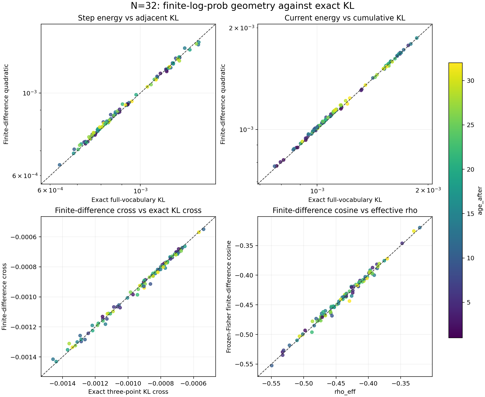
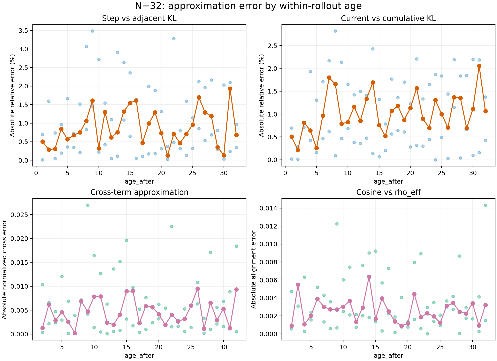

# N=32 logits 几何最大 age 校验：实验记录

实验设置见[本实验 README](../README.md)；公式和指标定义见
[实验族 README](../../README.md)。本记录使用 job 167221 的 3 个 rollout、96 条逐 update
记录，每个 age 只有 3 个 anchor 观测。

## 四项近似结果

| 比较 | 有效点 | 中位误差 | P95 | 最大误差 | 关联与符号 |
| --- | ---: | ---: | ---: | ---: | --- |
| `fd_step` 对 `adjacent_kl` | 96 | 绝对相对误差 0.736% | 2.662% | 3.485% | 预测/精确中位比 1.00518 |
| `fd_current` 对 `cumulative_kl` | 96 | 绝对相对误差 0.862% | 2.188% | 2.818% | 预测/精确中位比 1.00823 |
| `fd_cross` 对精确 cross | 93 | 归一化绝对误差 0.417% | 1.672% | 2.701% | Pearson 0.99766；符号 93/93 一致 |
| `fd_cosine` 对 `rho_eff` | 93 | 绝对差 0.00250 | 0.00878 | 0.01434 | Pearson 0.99561；符号 93/93 一致 |

交叉项原始 MAE 为 `1.16e-5`。`rho_eff` 与有限差分 cosine 的中位数分别为
`-0.43594` 和 `-0.43614`，全部已定义点都为负。精确累计 KL 最大值为 `1.8627e-3`。

`fd_current` 的绝对相对误差中位数在 age 1–4、5–8、9–16、17–32 四段分别为
`0.574%`、`1.134%`、`0.805%`、`1.120%`，没有呈现随 age 单调恶化；但每个 age 只有
3 个点，分段中位数只能作为描述。

上图分别回答整体贴合程度和误差随 age 的变化；颜色表示 age，逐 age 实线只有三个点的
中位数。矢量版本见 [`四项对照 PDF`](../figures/kl_approximation_2x2.pdf)和
[`逐 age 误差 PDF`](../figures/kl_approximation_error_by_age.pdf)。

## 解释与边界

在本次实际达到的累计 KL 范围内，有限差分几何到 age 32 仍未出现明显失效：两个正值
KL 代理的整体典型误差低于 1%，交叉项与方向量仍高度一致且符号完全一致。age 很大却
仍局部，关键是负对齐持续抵消，使实测累计 KL 最大值仍小于 `0.0019`；不能把这个结果
外推到更大累计漂移。

本组只有 3 个 rollout、单 seed，不能据此断言误差不随 age 增长，也不能证明 N=32 的
训练策略安全或有效。分析使用已经观测到的每一步 logits，只是回顾性几何校验。

## 复现

历史脚本 `../../scripts/analyze_kl_approximation.py` 从
`raw/job167221/kl_updates.jsonl` 只读生成 [`汇总 JSON`](../tables/kl_approximation_summary.json)、
[`逐 update 明细`](../tables/kl_approximation_per_update.csv)和
[`逐 age 汇总`](../tables/kl_approximation_by_age.csv)。

脚本已退役，按[历史脚本复现](../../README.md#历史脚本复现)从提交 `211675f` 取回。
