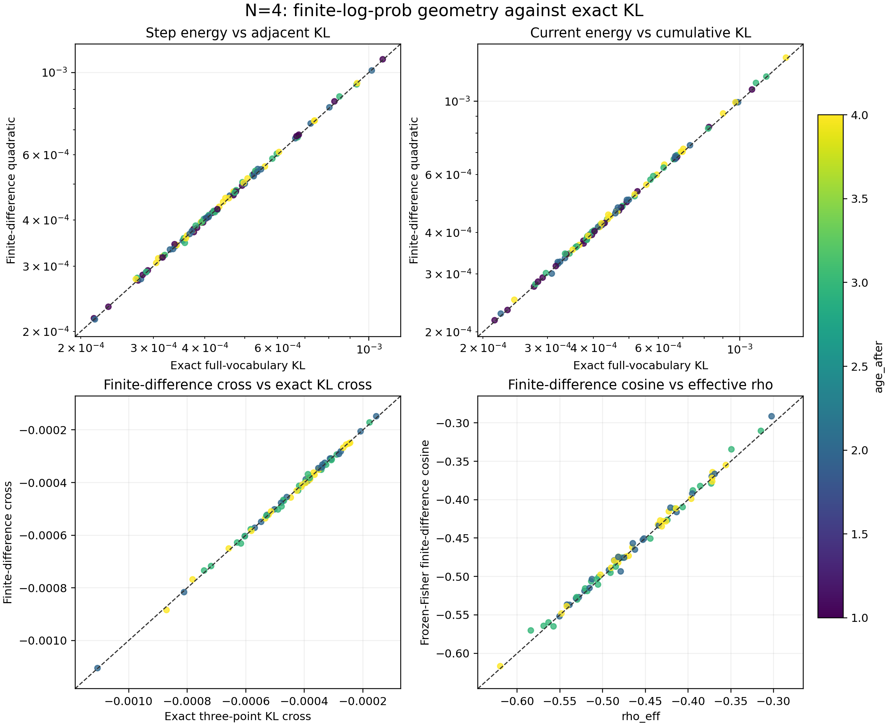
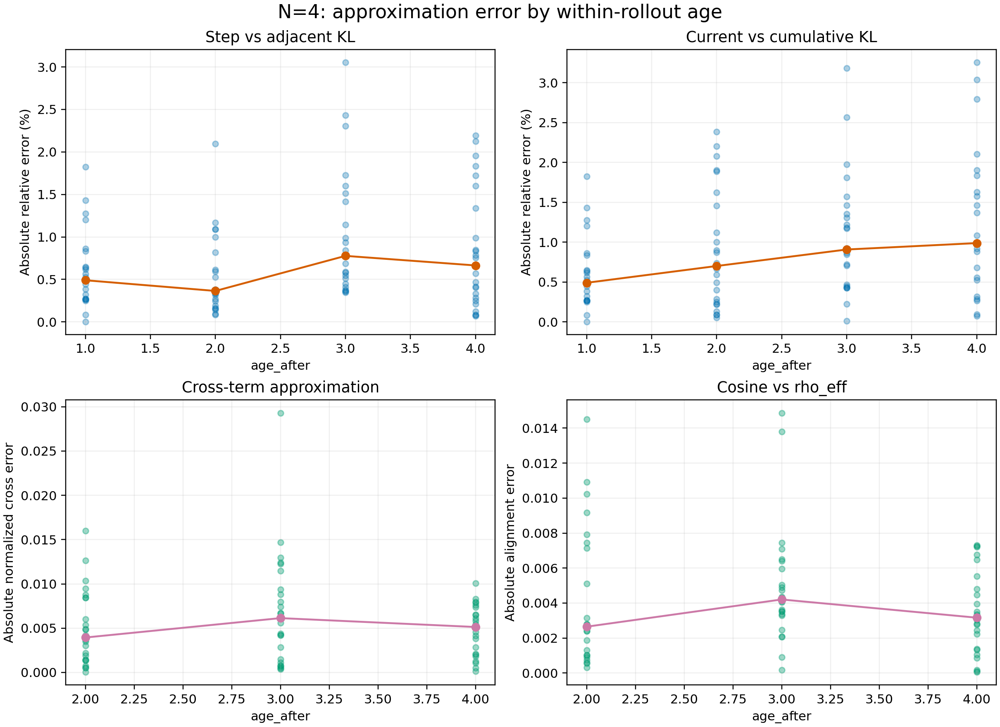

# N=4 logits 几何主校验：实验记录

实验设置见[本实验 README](../README.md)；四个比较的公式、误差定义和数学意义见
[实验族 README](../../README.md)。本记录使用 job 166278 的 24 个正式 rollout、96 条
逐 update 记录；job 166277 只作工程验收，不进入统计。

## 四项近似结果

| 比较 | 有效点 | 中位误差 | P95 | 最大误差 | 关联与符号 |
| --- | ---: | ---: | ---: | ---: | --- |
| `fd_step` 对 `adjacent_kl` | 96 | 绝对相对误差 0.536% | 2.105% | 3.053% | 预测/精确中位比 1.00392 |
| `fd_current` 对 `cumulative_kl` | 96 | 绝对相对误差 0.786% | 2.430% | 3.253% | 预测/精确中位比 1.00694 |
| `fd_cross` 对精确 cross | 72 | 归一化绝对误差 0.486% | 1.278% | 2.931% | Pearson 0.99931；符号 72/72 一致 |
| `fd_cosine` 对 `rho_eff` | 72 | 绝对差 0.00336 | 0.01054 | 0.01487 | Pearson 0.99725；符号 72/72 一致 |

交叉项原始 MAE 为 `4.83e-6`。`rho_eff` 与有限差分 cosine 的中位数分别为
`-0.47634` 和 `-0.47447`，全部 72 个已定义点都为负。精确累计 KL 的最大值为
`1.3371e-3`。精确三点恒等式和有限差分平方展开的最大闭合误差分别为 `8.67e-19` 和
`4.34e-19`。

主图回答四个代理是否贴近各自精确目标；颜色表示 age，虚线为 `y=x`。下面的图回答
误差是否随 age 发生明显漂移；点为单条记录，实线为逐 age 中位数。

两图的矢量版本分别为 [`四项对照 PDF`](../figures/kl_approximation_2x2.pdf)和
[`逐 age 误差 PDF`](../figures/kl_approximation_error_by_age.pdf)。

## 解释

四步窗口内，有限差分二次几何对相邻和累计 KL 的典型误差都低于 1%。交叉项和方向量
不仅相关性高，而且符号完全一致；因此，本实验中精确 `rho_eff` 的持续负值可以解释为
固定 anchor 输出几何下的新一步变化与此前累计变化负对齐，造成方向抵消。这为“累计
KL 不能把相邻 KL 直接相加”提供了直接的有限差分几何证据。

这个结论仍不是严格参数空间 JVP frozen-Fisher 校准，也不说明可从前四步预测未来 KL。

## 补充：gradient norm 与 update norm 换算

旧版 N=4 分析所记录的结论保留在本子实验中：`d/(eta G)^2` 的典型波动因子为
`1.2766`、IQR factor 为 `1.5889`；`d/||u||^2` 分别为 `1.2481`、`1.6328`。实际
`update_norm` 略减小典型偏差和按 age 的中位系数漂移，但整体 IQR 没有改善，因此不能
声称它显著优于 raw gradient norm。完整表见
[`conversion_stability.csv`](../tables/conversion_stability.csv)。

## 复现与边界

统一分析脚本 [`../../scripts/analyze_kl_approximation.py`](../../scripts/analyze_kl_approximation.py)
生成 [`汇总 JSON`](../tables/kl_approximation_summary.json)、
[`逐 update 明细`](../tables/kl_approximation_per_update.csv)和
[`逐 age 汇总`](../tables/kl_approximation_by_age.csv)。N=4 的补充换算由
[`analyze_results.py`](../scripts/analyze_results.py)生成。所有结果来自单 seed 已观测轨迹；
同一 rollout 内四行共享 anchor 和上下文，不作为 IID 样本解释。
